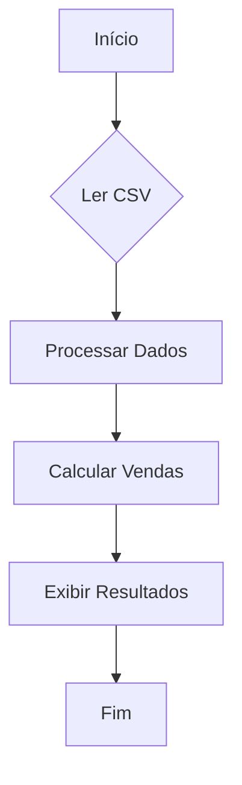

# aula07_bootcamp
Aula e exercícios sobre funções e execução do desafio, seguindo o fluxograma:

```mermaid
graph TD;
    A[Início] --> B{Ler CSV};
    B --> C[Processar Dados];
    C --> D[Calcular Vendas];
    D --> E[Exibir Resultados];
    E --> F[Fim];
```